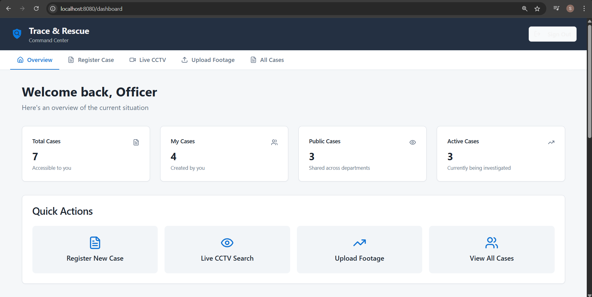
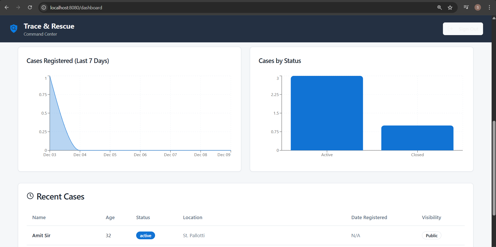

A real-time AI-powered Missing Person Detection System that uses CCTV video feeds, Face Recognition, and automated alerting to help authorities identify missing individuals quickly.
The system captures CCTV frames, compares them with registered missing person images, and sends WhatsApp + Email alerts instantly when a match is found.

Built with:
FastAPI (Backend API)
Python + OpenCV + LBPH Face Recognition
React + Tailwind (Frontend Dashboard)
Supabase (Database & Auth)
PyWhatKit (WhatsApp automation)
SMTP (Email notifications)

🚀 Features

🔹 AI-Powered Face Recognition
      Extracts face samples automatically from CCTV
      Trains an LBPH (Local Binary Patterns Histograms) model
      Compares live CCTV faces with registered missing persons in real-time

🔹 Automated Alerts System
      Sends WhatsApp alerts with details & timestamp
      Sends email alerts with the detected snapshot
      Includes cooldown to prevent spam

🔹 Case Management System
      Add, update, close missing person cases
      Public and private cases
      Detailed profile view

🔹 Live CCTV Search
      React frontend triggers backend pipeline:
      Capture → Train → Recognize → Detect → Notify

🔹 Fast, Modular Backend
      Built with FastAPI
      Clean endpoint structure
      Async-friendly API
      Fully connected with Python scripts for image capture & model prediction

🧠 System Architecture

      React Frontend ──▶ FastAPI Backend ──▶ Python Recognition Engine
                              │
                              ▼
                          Supabase DB
                              │
                              ▼
                     WhatsApp + Email Alerts

Backend Flow

  User selects a missing person case
  Frontend sends request → /capture-face
  Backend runs Python script → captures 50 face samples
  Frontend triggers → /train-model
  Backend trains LBPH model
  Frontend triggers → /recognize
  Backend starts CCTV stream face recognition
  On match →
    Send WhatsApp alert
    Send email with snapshot
    Save detection result in DB
    Stop the recognition loop
  Frontend fetches /get-found-person repeatedly
  Displays detection snapshot and details

📁 Backend Folder Structure

Backend/

│── main.py                  # FastAPI app

│── capture_faces.py         # CCTV face sample collector

│── train_model.py           # LBPH model trainer

│── recognize_face.py        # Real-time recognition & alerting

│── found_snapshots/         # Saved match images

│── missing_person_images/   # Training dataset auto-generated

⚙️ Installation & Setup
1️⃣ Clone the Repository
      git clone https://github.com/your-username/your-repo-name.git
      cd your-repo-name

2️⃣ Install Python Dependencies
      pip install -r requirements.txt

3️⃣ Start Backend
      cd Backend
      uvicorn main:app --reload --host 0.0.0.0 --port 8000

4️⃣ Start Frontend
      cd frontend
      npm install
      npm run dev

🧪 Recognition Accuracy
Component	Expected Accuracy
LBPH Face Recognition (controlled photos)	85–95%
Live CCTV detection (real conditions)	70–85%
With good lighting + clear face	90%+ reliable

Accuracy depends on:
  distance from camera
  lighting conditions
  number of training samples (more = higher accuracy)

📡 API Endpoints (Backend)
Endpoint	Method	Description
/capture-face	POST	Captures 50 face samples for model training

/train-model	POST	Trains LBPH model using saved images

/recognize	POST	Starts CCTV recognition loop

/person-found	POST	Backend stores detection result

/get-found-person	GET	Returns latest detection for UI

/get-found-image	GET	Serves snapshot image

For Locally hosting/running the Website

To Run Backend(copy-paste the command given below on terminal):

      cd Backend
      uvicorn main:app --reload --host 0.0.0.0 --port 8000

---------------------------------------------------------------------------------------------

To Run Frontend(copy-paste the command given below on another terminal):

      npm run dev

📷 Screenshots (Add after uploading images)

📌 Use Cases

Police missing-person departments

Rescue operations

Smart surveillance systems

Public safety organizations

NGOs handling lost-person cases

------------------------------------------------------------
AUTHOR
------------------------------------------------------------

Shubham Dhabu  
Open to collaboration 
